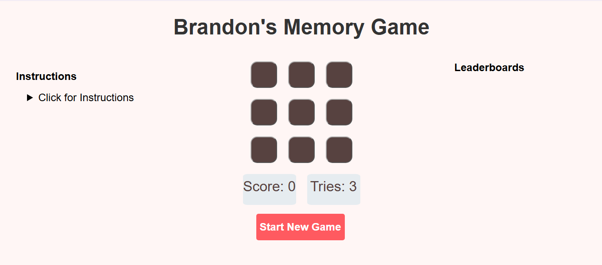
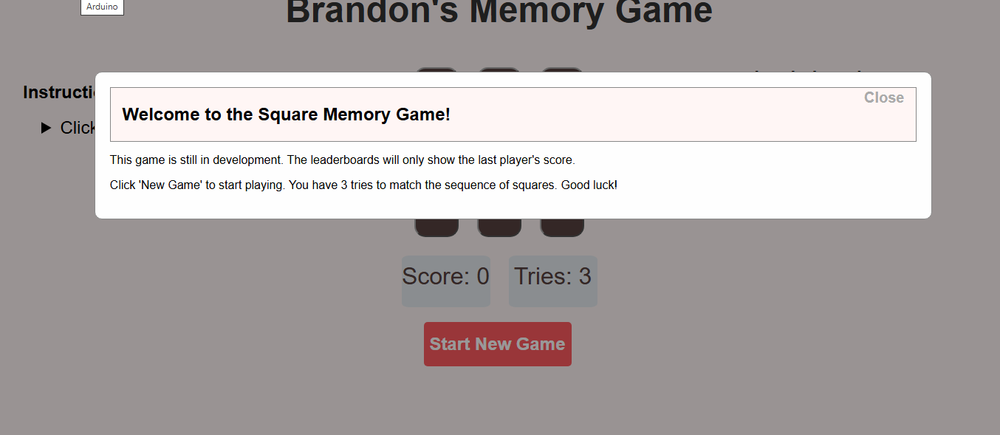
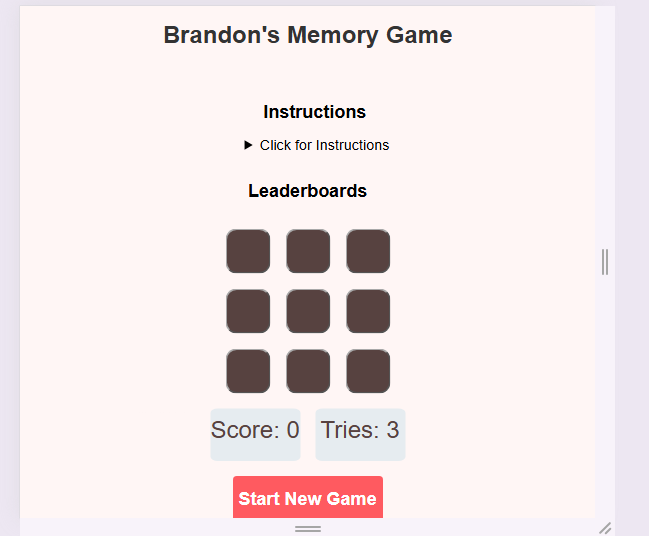
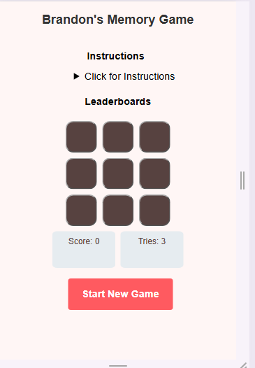
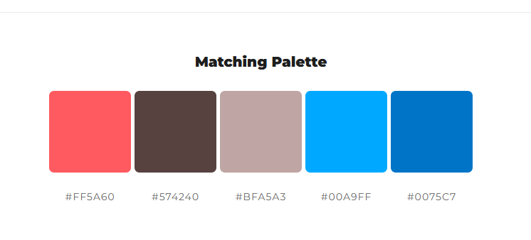
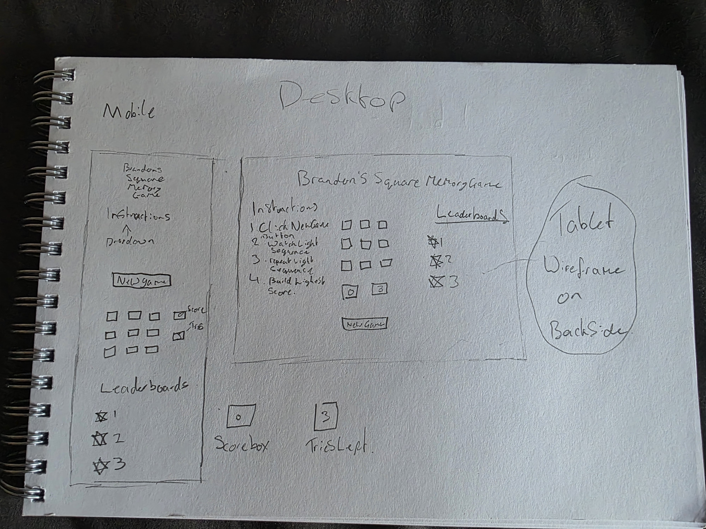
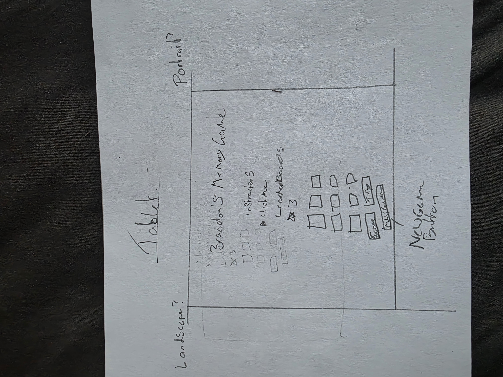

# Square Memory Game

[Live Site](https://bikerbrandon2282.github.io/square-memory-game/)

Image of Live game screen

## Table of Contents

1. [Project Overview](#project-overview)
2. [User Experience](#user-stories)
   - [User Stories](#user-stories)
   - [UX Goals](#user-experience-goals)
   - [Developer Challenges](#developer-challenges)
3. [Design](#design)
   - [Screenshots](#screenshots)
   - [Colour Pallette](#colour-pallette)
   - [Typography](#typography)
   - [Accessibility](#accessibility)
   - [Wireframe Images](#wireframes)
4. [Features](#features)
   - [Home Page](#home-page)
   - [Favicons](#favicons)
6. [Technologies Used](#technologies-used)
8. [Testing](#testing)
   - [Manual Testing Table](#manual-testing-table)
   - [Cross-Browser Testing](#cross-browser-testing)
   - [Validator Testing](#validator-testing)
   - [WAVE - Web Accessibility Evaluation Tools](#wave---web-accessibility-evaluation-tools)
   - [Lighthouse Summary](#lighthouse-summary)
        - [Lighthouse Optimization Reflections](#lighthouse-optimization-reflections)
        - [Accessibility Testing](#accessibility-testing)
9. [Deployment](#deployment)
10. [Credits](#credits)
11. [Reflections](#reflections)

---

## Project Overview

This Website is a Memory game, based on the [Simon Memory Game](https://bikerbrandon2282.github.io/simon-memory-game/). I used this repo and game design to base my starting point from, As it has alot of the features I am going to need in order to make this a functional game.

This was chosen from one of the options for my Code Institute Milestone 2 Development project, as It is a fun game, reasonably easy to code and puts an interesting twist on the original game.

This game is easy to play, has a drop down menu for reading the instructions on how to play. The intention of this game is to provide a simple yet fun way to pass time and provide an enjoyable user experience.

[Back to Top](#square-memory-game)

User Experience
===============

Below are the User stories from the main users of the Website, These have been built with the websites target audience and the intended user experience in mind. 

## User Stories

### Story 1
As Site Owner I want to have a game that can be played easily by all ages and played as many times as someone likes without refreshing and resetting the score.

### Story 2

As a First Time User I would like to be able to read the instructions for the game in case I am unsure on how to play. 

### User Goals
These Goals have been derived from the above respective User Stories for an easier time tracking features.

### Story 1

- To create a easy-to-play game that can be used by any age
- To allow the game to continue infinitely (or until you get bored and stop.) 
- To allow people to see how high a score they can get.

### Story 2

- To be a able to easily read instructions on how to play the game.
- To be able to re-read instructions during gameplay

> Developer Note: Maybe use a Modal for instructions on page load then have a details drop down for seamless reading during gameplay

## Development Challenges

Throughout this website's development I have been faced with multiple challenges Some of these are detailed below.

- I was originally using a basic grid for the buttons and had a very hard time trying to organise the instructions, leaderboards, scorebox and new game button on the screen where I wanted it. To overcome this challenge I watched a [Youtube video]("https://www.youtube.com/watch?v=JYfiaSKeYhE/")

- I still struggled with placing and orientating the grid layout on multiple screens which has taken up so much of my time that my project was submitted late. (I am still struggling with this) With this issue, I am currently exploring and researching alternative methods to the grid layout that will still produce my intended design but with a little more adaptability as my main issue was with sizing issues and as the grid was not evenly filled it produced problems with layouts on smaller screens in which divs and other elements would overflow from there grid space and become unadaptable for moving it to a different layout on screen. Using Google AI mode to help me discuss options that would produce a similar output to the current layout, I am likely to change back to a Flexbox layout with defined parameters to specify where I want each item, however this is likely going to require a restructure of my HTML layout to bring the required output to be near-identical

- Branching from the above challange, I have implemented flexbox and styled it in a way that matches the original layout, This was a big switch however was much needed as the grid structure was very rigid and did not translate to smaller screens very well, but with the help of Microsoft CoPilot, this has been acheived and the layout now converts across all devices successfully.

## Design

For the design of my website I went with a basic page with 9 buttons to add a bit of a challenge to players prone to higher scores than the typical 4/5 buttons, a leaderboard table with the potential to see previous scores that give you a target to beat. I also added an Instructions dropdown and modal on load of page with the instructions on to give new players a guide on how to get started, This then can be closed with the relevant 'Close' button, and incase players forget or need a reminder, or even simply skip the modal without reading it, The Instructions dropdown gives a interactive way for players to re-read instructions mid-game. Currently the modal also states that this game is under development and the leaderboards will only show the last score and not a table of recent scores. This will remain the case until such time as I complete my Milestone 3 project to work with databases, after this, I will return to this game in order to add a simple database to store the last 3 players scores, and possibly their names/initials to go along with them. For now, the game is fully functional as intended, provided players with info on how to play and shows the current score, remaining tries, and provides feedback to the user in order to inform the user that the last move was incorrect. Below are screenshots of the website on Mobile, Tablet, and Desktop views in respective order.

### Screenshots
This is the view of the Modal on all screens with the height and width adjusting to the current Viewport size.

Modal presented to user on page load

Desktop View

Tablet View

Mobile View

## Colour Pallette

For the Colour Scheme of the site I chose the Colour Pallette below I got this from my starting colour of #FF5A60 which was used for my new game button, This was generated using the Color.space website linked in my credits below I tried the different colours to see if I could find a good background colour with a good contrasts with the buttons on the page, Any bright colour e.g. #0075C7, made it more difficult to play the game as when the button fades to show you the next sequence it can be hard to see which button was actually shown, The fade just blended into the background too much. And so I decided to use 

## Typography

For the Typography of the project, I have chosen to stay with the default font of the webpage as there is very little written words on my page and I believe it serves it's purpose well. If I were to have the instructions statically on the page or there was more paragraphs for my game then I would be looking at using a google font that works with the colour scheme, however as this is not the case. I think the default font for words works very well, keeps all writing very easy to read and saves development time normally consumed by researching which font will work for the project.

## Accessibility
Below you will see several images shown during my testing process to ensure that you can use the game by using only the 'Tab' key and the 'Enter' Keys. I have used Microsoft CoPilot to help with some areas of my code and there is also a screenshot below of it's response stating that it is very accessible to screen readers, as I do not have one available to me. Accessiblity can be a challenge to keep consistent once a project has already been started and that's why it is always important to take it into account when first building the project as this will save time with redesign and similar issues further down the line if you build a website then start working on the accessibility of the website.

## Wireframes
The wireframes for this project were made by hand drawings during my free time at work as I found it a little easier for this website as I already had a plan laid out and saw it as easier to 'put down on paper' so to speak. Rather than using a web-based wireframe that requires multiple drag and drop components. See the images below of these drawings within my sketchbook.

Mobile and Desktop Wireframes

Tablet Wireframe

# Features

## Home page

This is the 'Homepage' of the website, as the website is a basic game it does not have multiple pages it runs everything on the main page for the user to see all information availible like the instructions, leaderboards, and actual game tiles. Maybe in future once I expand the Leaderboards functionality with a database to hold a full list of previous scores, I could look at a separate page for this, however this is not needed yet and it outside of my current skillset.

## Favicons

I made the below favicon using a generator I found online, It currently looks a little blurry but this is because it is a blown up image of what is designed to be very small, I have attempted to use a number of free converters, upscalers and resolution increasing websites to enhance the image so it would look more clear on a bigger view however all of these only made the image worse, so I have just adjusted the size to a proportion visible to see the design but not make it blurry or distorted.

I have this image added to the website in a few sizes to account for different devices, browsers and to keep it visible of any device for example I have it in an apple-touch-icon, and favicon in 16x16 and 32x32.

# Technologies Used

Here is a brief list of the technologies I have used for the development of this website

- Google Gemini AI - This was used for suggestions on better layout implementations
- Microsoft CoPilot - CoPilot was used towards the end to improve flexbox layout and give suggestions on optimising code where possible
- Visual Studio Code - This was used to build the website as well as host a local server for testing.
- Git/Github - GitHub was used for commit tracking and keeping code updates organised and retrievable
- Github Pages - GH Pages was used to host the main website once all changes had been commited and testing was complete

# Testing

## Manual Testing Table

| Test Area | Test Description | Expected Result | Actual Result | Status |
| --- | --- | --- | --- | --- |
| **Modal Display** | Load the page and observe whether the instructions modal appears automatically. | Modal should display on page load with instructions visible. | Modal displayed correctly on page load. | ✔️ Passed |
| **Instructions Details Toggle** | Click the “Click for Instructions” ``
`` element. | Instructions text should expand and collapse when toggled. | Instructions expanded and collapsed as expected. | ✔️ Passed |
| **Game Board Buttons** | Click each of the 9 square buttons during gameplay. | Each button should register a move, light up briefly, and interact with the sequence logic. | All buttons responded correctly and lit up when expected. | ✔️ Passed |
| **New Game Button** | Click the “Start New Game” button. | Game should reset score, tries, and generate a new sequence. | Game reset correctly and generated a new sequence. | ✔️ Passed |
| **Score Box Updates** | Complete a correct sequence. | Score should increase by 1. | Score updated correctly. | ✔️ Passed |
| **Try Count Updates** | Make an incorrect move. | Try count should decrease by 1. | Try count decreased correctly. | ✔️ Passed |
| **Wrong Move Alerts** | Click an incorrect square during a sequence. | Alert should display “Wrong move!” and sequence should restart. | Alert displayed and sequence restarted. | ✔️ Passed |
| **Game Over Alert** | Use all tries by making repeated incorrect moves. | Alert should display “Game Over!” with final score. | Game Over alert displayed correctly with score. | ✔️ Passed |
| **Leaderboard Update** | Finish a game and trigger Game Over. | Leaderboard should show the last player’s score. | Leaderboard updated with last score. | ✔️ Passed |
## Cross-Browser Testing

I used my friend as a test subject here as I use an android phone and he uses Apple Iphones so I could compare if there was any major issues that needs resolving for compatibilty reasons, However as you can see in the below screenshot of our conversation, Dalton had no issues using the website and was happy with it.

## Validator Testing

### HTML

Here is our first validation which shows only one error which was that I had a ARIA-LABEL on a span element without role

Below is the screenshot showing no errors, The span element error was fixed simply by changing the span element to a button element, however this also required me to add some addition styles to the .close style rule in CSS as the button element comes with a default background colour and border which I removed to bring back the styles in place before and make the button blend with the header of the modal better. This error actually helped as it showed me that I have the button placed slighly closer to the top of the header than desired so I added a 5px margin to bring this down.

### CSS

## WAVE - Web Accessibility Evaluation Tools

I used the <a href = "https://wave.webaim.org/">WAVE</a> tool website to test my websites usability and accessiblity. This was successful as my only issue was with contrast as you'll see below

The inital test shows that I had 1 issue which was my contrast on the close button for the modal.

This is the Contrast ratio I had before, And shows that this ratio failed the test.

This is the Contrast ratio after I adjusted the slider to change the lightness to a colour I was happy with as I still wanted to keep the colour adjusting when hovered over

Finally I retested the website to ensure there was no other issues and this is the below screenshot I ended with showing a 10/10 score!

# Lighthouse Summary

## Lighthouse Optimisation Reflections

## User Feedback Testing

# Deployment

- Login to Github
- Locate the Motorbikes-for-beginners Repository
- Navigate to the Repo's settings page
- open the pages tab in the Code and automation section
- choose from the Branch dropdown menu 'main' as we want to deploy the site from the main branch
- Ensure the '/root' folder is selected in the next dropdown menu and click save.
- Wait a few minutes for the page to be built, then go to the main 'code' tab to find the Deployment section along side the code (see screenshot below) and click the link to 'github-pages' as this is the environment we deployed with.

- You should now see a screen like below with your link to your deployed website.

# Credits

Here is a list of all the the websites or people I have used or collaborated with in order to complete this project and fix bugs in the code.

- Google Gemini AI - Used to suggest different methods of implementation or to remind me of the syntax for such things like semantic tags, Meta data
- Microsoft CoPilot - Used to help me refactor the design from a rigid grid template layout into a flexbox design without disturbing the locations of everything on the page.
- <a href = "https://favicon.io/">Favicon Generator</a>
- <a href = "https://stackoverflow.com/">Stack Overflow</a> - Used for debugging any issues when CSS won't correctly adjust elements (usually simply because I have used .class to attach the style rule on a #id element or the other way around xD)
- <a href = "https://github.com/bikerbrandon2282/simon-memory-game">Simon Game Repository</a> This is my own Repo that has been built by me following along a Code Institute Challenge and video. This was used solely for the basic game functions that make it display and read player moves, This was the inital code which was then expanded to include more buttons and additional function for the leaderboards and Trys counter.
- <a href = "https://wave.webaim.org/">WAVE accessibility website</a> This website was for testing usability of website

# Reflections

This website is still very far behind being a finished product, However I have ran out of time to finish it and must submit something and progress with the rest of my course before I fall even more behind, When I get my results back, I am fully aware this will be an astonishingly state of a fail. However during the course of this project it has been the summer season with tremendous heatwaves which has resulted in the room my Computer is located in being uninhabitable, I have attempted to switch to working on my laptop for the remainder of the project however due to it being a Microsoft Surface pro, the layout of each device is completely different and stunts my progress so I began going to my computer every time the heat dies down and at night when I don't need to be sleeping for work the next morning, However due to the awkwardness of this It has caused me to fall quite behind, further than I believed I was. By the time I receive my results and have to resubmit I am hoping to be in a much better position, Temperature wise and milestone 3 wise. Whilst this is under review and whatever consequence comes, I will be continuing to improve and move this  project forward as and when I find time inbetween work and my portal learning, I know the readME is the biggest hurdle and needs alot more work, this will be slowly progressed as and when I can, There is a few photos and images in my images folder for this repo that have not yet been added to the site, I will be getting to these.. and The main game is currently under some layout issues with different devices behaving very differently, for example I added the mobile layout media query and lost all interaction with the squares solely on a mobile (was absolutely fine in chrome devTools mobile view) this is still being developed as I regained functionality of buttons 4-9 however the top buttons (1-3) don't seem to like being pressed on a mobile, I suspect this is something with the eventhandlers and will be looking into it. 

As much as this module has severly impacted my motivation to continue and my mental health in general, I am trying to see this for the massive learning curve that it is.. Review me with the upmost Generosity and Pity X'D